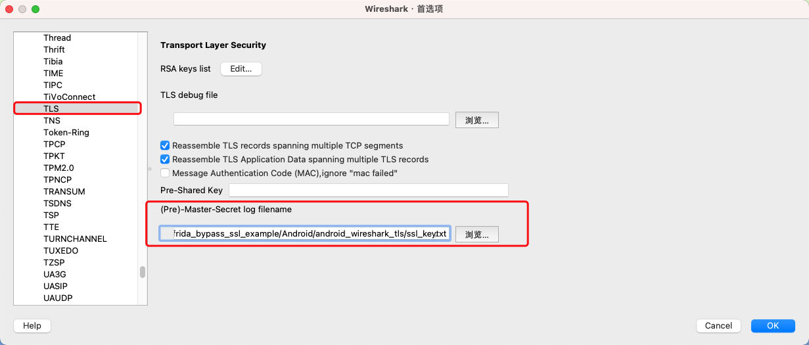
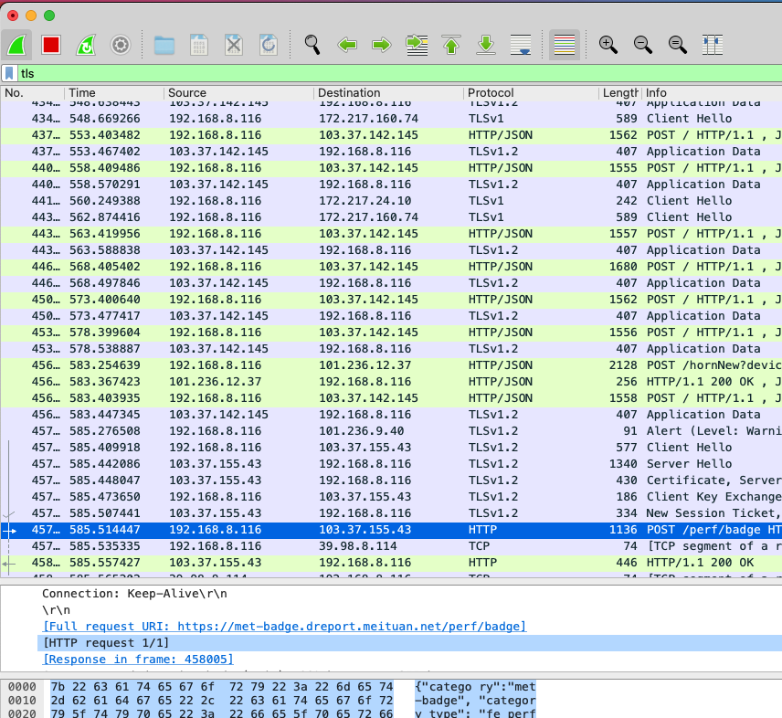

# Android使用Wireshark抓包


## 0. 环境
```
1. root手机
2. frida环境
3. 手机安装tcpdump (从这里下载 https://www.androidtcpdump.com/android-tcpdump/downloads )
4. 电脑安装wireshark
```

## 1. 手机运行tcpdump

```
adb shell su -c "/data/local/tmp/tcpdump -i any -U -w - | nc -l -p 11233"
```

## 2. 转发tcpdump到Wireshark

```
adb forward tcp:11233 tcp:11233 && nc 127.0.0.1 11233 | wireshark -k -S -i -
```

## 3. Wireshark配置TLS的log



## 4. 运行sslkey_log.py

```
python sslkey_log.py packagename
```

## 5. 效果



